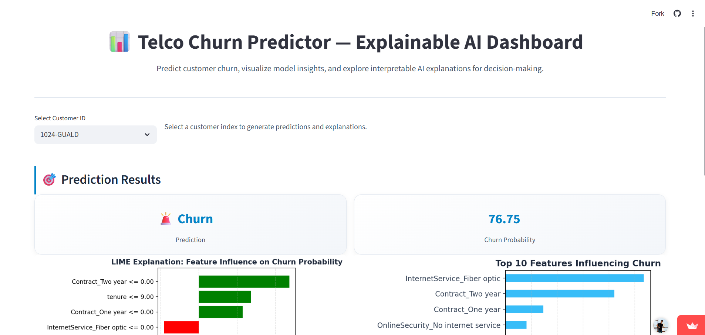

# 📊 Telco Churn Predictor — Explainable AI Dashboard

An end-to-end **Machine Learning + Explainable AI** project that predicts customer churn and explains *why* customers leave, enabling **proactive retention strategies**.

---

## 🖼 Dashboard Preview

---

## 🚀 Key Highlights
- Churn prediction with **80% accuracy**
- **XGBoost** for robust tabular modeling
- **LIME** for transparent, customer-level explanations
- Interactive **Streamlit dashboard** for business users

---

## 🧠 Model & Data
- Dataset: 7,043 telecom customers  
- Features: 31 after preprocessing  
- Target: Churn (Yes / No)  
- ROC-AUC: **0.713**

---

## 🔍 Explainable AI
- **Global:** Feature importance (Tenure, MonthlyCharges, Contract)
- **Local:** LIME explanations for individual customers

---

## 💼 Business Impact
- Early identification of at-risk customers
- Enables targeted retention campaigns
- Turns ML predictions into actionable insights

---

## 🛠 Tech Stack
**Python, Pandas, NumPy, Scikit-learn, XGBoost, LIME, Streamlit**

